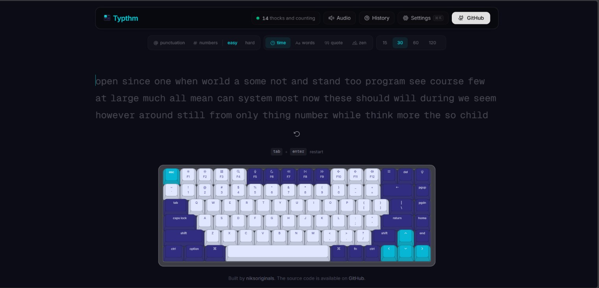

# Typthm

<div align="center">
  
  <br />
  <br />
  <a href="https://typthm.niksoriginals.in/"><strong>⚡ Try Now →</strong></a>
</div>

**The typing test that _sounds_ as good as it feels.**

Free · Open Source · Real-time WPM · Mechanical Key Sounds

* [Try it live →](https://typthm.niksoriginals.in/)
* [Report Bug](https://github.com/niksoriginals/typthm/issues)
* [Request Feature](https://github.com/niksoriginals/typthm/issues/new?labels=enhancement&template=FEATURE_REQUEST_TEMPLATE.md)

---

## What is Typthm?

Typthm is a free, open-source typing test that combines real-time WPM tracking with immersive mechanical keyboard sounds. Every keystroke feels satisfying — whether you're practicing speed, accuracy, or just vibing with the clicks.

---

## Features

* **Test Modes**: Time (15s · 30s · 60s · 120s), word count, quotes, zen
* **Mechanical Sounds**: Realistic per-key audio via Web Audio API
* **Virtual Keyboard**: Interactive on-screen keyboard with live key highlighting
* **Detailed Results**: WPM, raw speed, accuracy, character breakdown, consistency, WPM-over-time chart
* **7 Keyboard Themes**: Aurora (default), Ember, Mint, Royal, Dolch, Sand, Scarlet — each tints the entire UI
* **11 Typing Fonts**: Geist Mono, JetBrains Mono, Fira Code, IBM Plex Mono, Source Code Pro, Inter Tight, Space Grotesk, Nunito, Atkinson Hyperlegible, SF Pro, Outfit
* **Settings**: Light/dark/OLED/system theme, accent colors, font picker, keyboard toggle, volume slider, live WPM, ghost mode
* **Haptics**: Optional vibration feedback on supported devices
* **Persistence**: All preferences auto-saved in `localStorage`

---

## Tech Stack

* **Framework**: Next.js 16 (React 19)
* **Styling**: Tailwind CSS
* **Components**: Base UI & shadcn/ui recipes
* **Animations**: Motion
* **Charts**: Recharts
* **Database**: SQLite with Drizzle ORM
* **Linter & Formatter**: Biome
* **Service Worker**: Serwist (PWA support)

---

## Quick Start

Make sure you have Git and Bun (or Node.js 20+) installed.

```bash
# 1. Clone the repository
git clone https://github.com/niksoriginals/typthm.git
cd typthm

# 2. Install dependencies
bun install

# 3. Start dev server
bun dev
```

Open **http://localhost:3000** and start typing!

---

## Scripts

* `bun dev` - Start development server
* `bun run build` - Create optimized production build
* `bun start` - Serve production build locally
* `bun run lint` - Lint with Biome
* `bun run lint:fix` - Lint and auto-fix
* `bun run format` - Format codebase
* `bun run typecheck` - Type-check with TypeScript

---

## Deploy Your Own

* **Vercel**: You can import this project directly on Vercel using their dashboard.
* **Netlify**: You can import the repository from GitHub into Netlify.
* **Manual**: Build locally using `bun run build` and start using `bun start`.

---

## Contributing

Contributions make the open-source community an incredible place to learn, inspire, and create. All contributions are welcome!

1. Fork the repository
2. Create your branch: `git checkout -b feature/amazing-feature`
3. Commit your changes: `git commit -m "Add amazing feature"`
4. Push to the branch: `git push origin feature/amazing-feature`
5. Open a Pull Request

---

## Connect

* [GitHub Profile](https://github.com/niksoriginals)
* [LinkedIn](https://www.linkedin.com/in/niksoriginals)

---

**Built with ❤️ by [niksoriginals](https://github.com/niksoriginals)**
